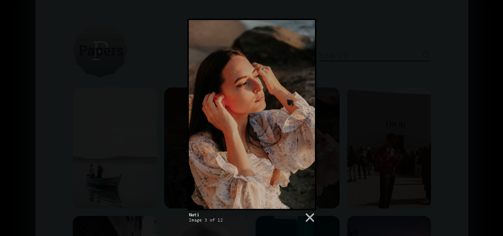

### Basic information

- **Title:** Papers
- **Category:** WebApp
- **Description:** _Papers WebApp uses Pexel api to deliver high-quality wallpaper content. The website offers a wide variety of wallpapers for users to choose from, and the content is updated regularly. Additionally, the website has all the features that are necessary to be a successful wallpaper website. This includes an easy navigation system, high-quality images, and a user-friendly interface._
- **Version:** 1.0

### Screenshots

### Things need to know

_API key -_

you get it from [pexels](https://www.pexels.com/api/new/)

    this.API_KEY = 'YOUR_API_KEY';
